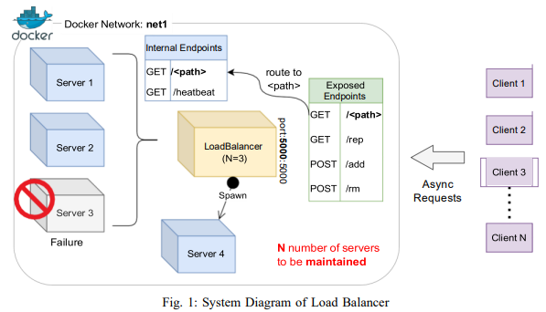

# Implementing a Customizable Load Balancer

## Overview


## Prerequisites

- [Python 3.8](https://www.python.org/downloads/release/python-380/) : Programming language.
- [Docker Desktop](https://www.docker.com/products/docker-desktop) : Running the application in a container.
- [Postman](https://www.postman.com/downloads/) : Testing the HTTP API endpoints.

## Installation
- Create a virtual environment:

```sh
 python -m venv venv
```

- Activate the virtual environment:

```sh
 source venv/bin/activate
```

## Usage

### 1) Server
- Build the server Docker image:
- Navigate to the server directory (where dockerfile is located) and run the following terminal commands.

```sh
 docker build -t server .  
```

- Run the server Docker container:

```sh
 docker run --name=server --rm --detach -p 5000:5000 server 
```

- Stop the Docker container:

```sh
 docker stop server
```

- Open your browser and go to the server endpoints:
   - http://127.0.0.1:5000/home to navigate to the `/home` endpoint.
   - http://127.0.0.1:5000/heartbeat to navigate to the `/heartbeat` endpoint.

### 2) Load Balancer
- Build the load balancer Docker image:

```sh
 docker build -t load_balancer .  
```

- Run the load balancer Docker container:

```sh
 docker run --name=server --rm --detach -p 5001:5001 load_balancer 
```

- Stop the load balancer Docker container:

```sh
 docker stop load_balancer
```

- Open your browser and go to the load balancer endpoints:
   - http://127.0.0.1:5001/rep to navigate to the `/rep` endpoint.
   - http://127.0.0.1:5001/add to navigate to the `/add` endpoint.
   - http://127.0.0.1:5001/rm to navigate to the `/rm` endpoint.
   - http://127.0.0.1:5001/<path:path> to navigate to the `/<path:path>` endpoint.

- Test the endpoints using Postman.
